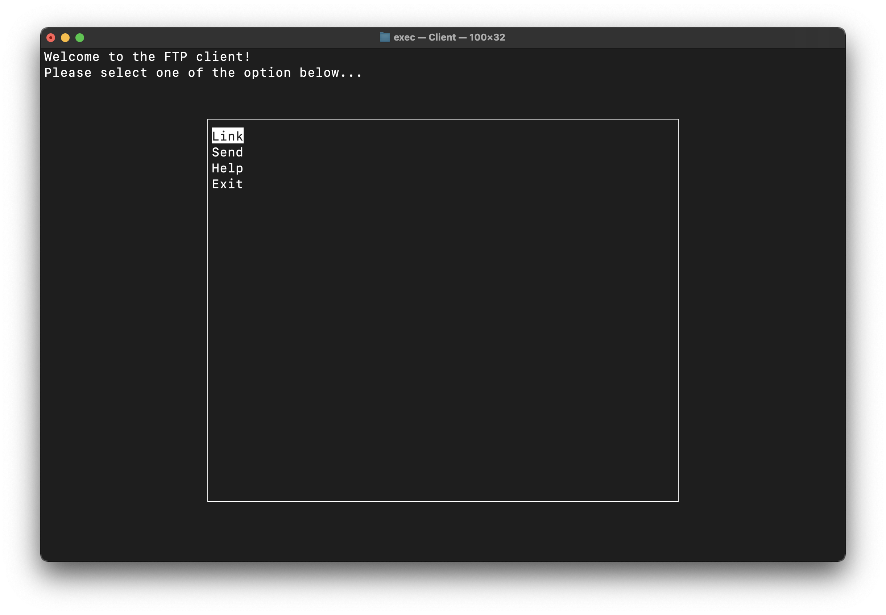

# FTP Program with Data Compression



## Build
Use CMake to build both the client and server program

```sh
mkdir build && cd build
cmake ..
make
```
Go to `exec` directory then you'll see the Client and Server program

## Usage
### Client Usage
- Use `./Client` to start the program.
- Use `./Client [IP] [port]` to connect to a host on start

#### GUI Usage

- Use the arrow keys or `jk` to navigate. Press enter to select.
- Connect: connect to a host.
    - IP and port number will be required.
- Send: send files to the host.
    - Support various compression encodings.
    - You need to establish a connection before sending files.
- Help: show this file.

### Server Usage

- Use `./Server` to start the program, the program will prompt to ask for the port number.
- Use `./Server` to specify the port number on start.

## Program design
This program was written in C++. With the access to the UNIX socket library, I can also modularize the program with C++'s class encapsulation. Moreover, the class inheritance and polymorphism is perfect for designing a Huffman encoding service with fixed-length and variable-length code.

### Client Side
[`Client.cpp`](./apps/Client.cpp) is a controller owning several views and services instances. The views are written in the ncurses C library serving as an interactive user interface. The services includes linking to a host and sending files.

The views do not contain any socket logics, instead they handle I/O and provide an interactive UI. On the other hand, the services is UI independent. And they don't interact with each other directly. The controller would drive the views and forward the user inputs from the  views to the services, then get the result from the services and send it to the views.

When sending files, it's important to send the file size in advanced, in which way can the server tell when to stop reading the file and save it to the disk.

When using Huffman encoding, the program would cache the encoded file and the codewords on disk and remove them after sent.

### Server Side:

[`Server.cpp`](./apps/Server.cpp) is rather a simple program, providing the ability to be made connection with and receive files from the client. When using Huffman encoding, the program first receives the encoded file and the codewords, then uses them to retrieve the original file. When the connection is closed by the client, the program proceeds to listen for another connection request.

### Huffman Encoding:

This library provides both fixed-length and variable-length code Huffman encodings. Since there are numerous shared procedures among both types of encoding, I defined class `Huffman` to be the base class and `HuffmanFix` and `HuffmanVar` are inheritance from it. Both of two derived class have two constructors. While one takes the name of the file to be encoded and generate the codewords, the other directly takes the codewords. The formerand latter are used by the encoding and decoding respectively.

The member function `encode` generates the encoded file with the codewords given by the constructor. The procedures are identical for both kinds of encoding so I wrote the function inside the base class `Huffman`.

On the other hand, the behavior differs when decoding files. So I wrote the member function `decode` Separately in the derived class. Yet, I can still smartly call them using polymorphism.

